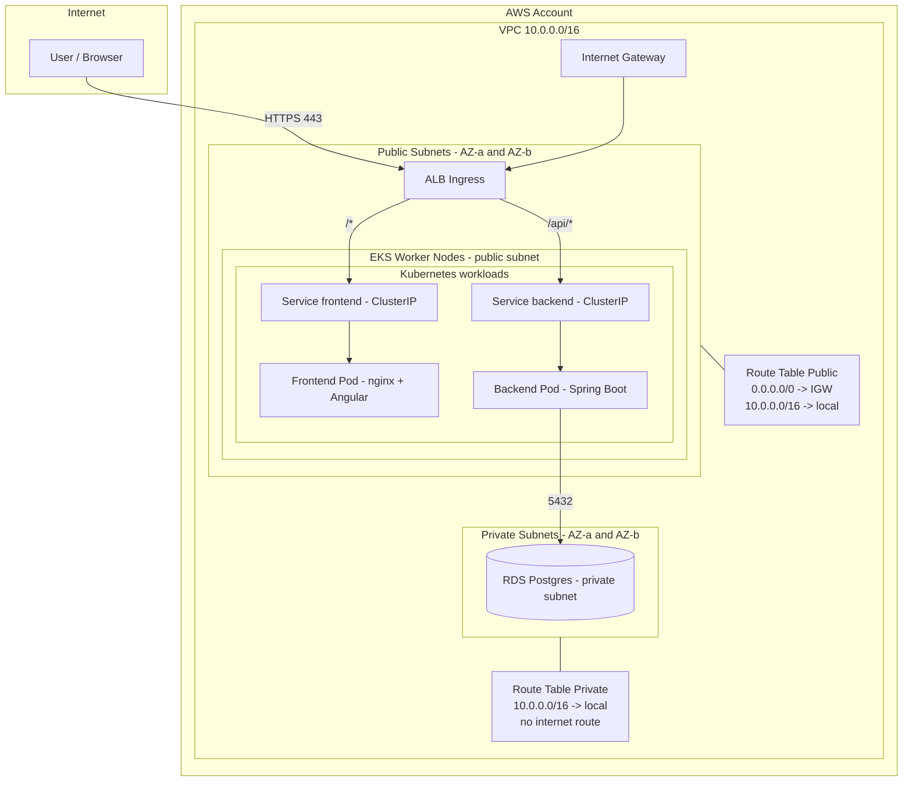

# AWS EKS + Spring Boot + Angular + RDS Postgres (bez NAT)
## Plan infrastruktury (Terraform) + wdrożenie (Kubernetes)

---

## 1. Założenia

1. **RDS w tym samym stacku co EKS**  
   Celem jest możliwość wyłączenia kosztów jednym poleceniem: `terraform destroy` (stack `infra`).

2. **Wariant bez NAT (tańszy)**  
   - Worker nody EKS działają w **public subnets** (mogą wychodzić do Internetu przez IGW).  
   - RDS działa w **private subnets** (bez bezpośredniego dostępu z Internetu).

3. **Aplikacje są stateless (bez PVC)**  
   - Frontend i backend nie wymagają trwałego dysku w Kubernetes.

4. **Wejście do aplikacji przez ALB Ingress**  
   - Używamy **AWS Load Balancer Controller**, który tworzy ALB na podstawie zasobu `Ingress`.

---

## 2. Cele

1. Ćwiczenie Kubernetes na AWS EKS.
2. Prosta architektura: **Frontend (Angular)** + **Backend (Spring Boot)** + **DB (RDS Postgres)**.
3. Minimalizacja kosztów i szybkie wyłączanie infrastruktury.
4. Terraform jako IaC (Infrastructure as Code).

---

## 3. Architektura docelowa

### 3.1. AWS (Terraform)

#### 3.1.1. Stack `tf-backend` (zostaje zawsze)
- **S3 bucket** – Terraform state
- **DynamoDB table** – Terraform lock

#### 3.1.2. Stack `infra` (do uruchamiania / niszczenia)
- **VPC** (2 AZ)
- **Public subnets** (ALB + EKS worker nodes)
- **Private subnets** (RDS)
- **IGW + Route Tables** (public ma trasę do IGW, private nie)
- **Security Groups**
- **EKS Cluster + Managed Node Group**
- **AWS Load Balancer Controller** (ALB Ingress)
- **RDS Postgres**
- **ECR repositories** (frontend + backend)

### 3.2. Kubernetes (EKS)

- **Namespace:** `app`
- **Deployments:** `frontend`, `backend`
- **Services:**  
  - `frontend-svc` (ClusterIP)  
  - `backend-svc` (ClusterIP)
- **Ingress (ALB):**
  - `/*` → `frontend-svc`
  - `/api/*` → `backend-svc`

---


## 4. Dlaczego IGW i Route Tables są potrzebne

### 4.1. IGW (Internet Gateway)

IGW umożliwia ruch **Internet ↔ VPC**. Jest potrzebny, aby:
- ruch z Internetu docierał do **ALB** (internet-facing),
- nody w public subnet mogły wychodzić do Internetu (np. pobieranie obrazów z ECR).

### 4.2. Route Tables

Route table przypięta do subnetu decyduje o trasach:
- **Public subnet:** ma trasę `0.0.0.0/0 → IGW` (to czyni subnet „publicznym”).
- **Private subnet:** nie ma trasy do Internetu (to czyni subnet „prywatnym”).

Każda route table ma domyślnie trasę:
- `VPC_CIDR → local`

Dzięki temu możliwa jest komunikacja wewnątrz VPC (np. backend → RDS) bez NAT.

---


## 5. Dlaczego backend połączy się z RDS bez NAT

1. Backend działa na nodach w **public subnets** (adresy IP w VPC).
2. RDS działa w **private subnets** (adresy IP w VPC).
3. Połączenie backend → RDS to ruch wewnątrz VPC i idzie trasą `VPC_CIDR → local`.

**NAT** jest potrzebny tylko wtedy, gdy zasób w **private subnet** chce wyjść do Internetu. RDS nie musi.

---


## 6. Dlaczego na start nie potrzebujesz EBS CSI Driver

EBS CSI Driver jest potrzebny, gdy w Kubernetesie używasz **PersistentVolumeClaim** opartych o AWS EBS (trwałe dyski).

W tym projekcie:
- frontend jest stateless,
- backend jest stateless,
- DB jest w RDS (poza klastrem).

Wniosek: **pomijamy EBS CSI Driver na start**.

---


## 7. Kill switch (wyłączanie kosztów)

### 7.1. Rekomendowane: pełne wyłączenie
1. `terraform destroy` in stack `infra`
2. Zostaje tylko `tf-backend` (S3 + DynamoDB)

### 7.2. Pauza (nie daje 0 kosztów)
1. Ustaw `desired = 0` w node group (brak workerów).
2. Opcjonalnie zatrzymaj RDS (ma ograniczenia czasowe).
3. EKS control plane nadal kosztuje.

---


## 8. Struktura repo (przykład)

```text
infra-repo/
  tf-backend/
    main.tf
    variables.tf
    outputs.tf
  infra/
    main.tf
    variables.tf
    outputs.tf
  k8s/
    namespace.yaml
    backend-deployment.yaml
    backend-service.yaml
    frontend-deployment.yaml
    frontend-service.yaml
    ingress.yaml
```

---


## 9. Plan krok po kroku (operacje)

### 9.1. Stack tf-backend (S3 + DynamoDB)
*Cel: remote state + lock dla Terraform.*
1. Utwórz S3 bucket na tfstate.
2. Utwórz DynamoDB table na lock.
3. Wykonaj: `terraform init` && `terraform apply`.
4. Zapisz: `bucket_name`, `dynamodb_table_name`.

### 9.2. Stack infra – backend S3 (remote state)
*Cel: infra korzysta z S3 + DynamoDB.*
1. Skonfiguruj backend w Terraform (bucket, key, region, dynamodb_table).
2. Wykonaj: `terraform init`.

### 9.3. VPC + subnets + IGW + route tables (bez NAT)
*Cel: ALB i EKS w public; RDS w private.*
- **VPC:** 10.0.0.0/16
- **Public:** 10.0.1.0/24 (AZ-a), 10.0.2.0/24 (AZ-b)
- **Private:** 10.0.101.0/24 (AZ-a), 10.0.102.0/24 (AZ-b)

1. Utwórz VPC.
2. Utwórz 2 public subnets i 2 private subnets w 2 AZ.
3. Utwórz IGW i podłącz do VPC.
4. Utwórz Public Route Table: trasa `0.0.0.0/0 → IGW`.
5. Utwórz Private Route Table: brak trasy `0.0.0.0/0`.
6. Zrób associations: public subnets → public RT, private subnets → private RT.

### 9.4. Security Groups
*Cel: szczelny routing po portach.*
- `sg_alb`: inbound 80/443 z Internetu.
- `sg_backend`: inbound 8080 tylko z `sg_alb`, outbound 5432 do `sg_rds`.
- `sg_rds`: inbound 5432 tylko z `sg_backend`.
- RDS: `publicly_accessible = false`.

### 9.5. EKS + Node Group (public subnets)
*Cel: klaster EKS bez NAT.*
1. Utwórz EKS cluster.
2. Utwórz Managed Node Group (subnets: public, desired=1, min=0, max=2).
3. Skonfiguruj kubeconfig: `aws eks update-kubeconfig --name <cluster> --region <region>`.
4. Sprawdź: `kubectl get nodes`.

### 9.6. AWS Load Balancer Controller
*Cel: Ingress tworzy ALB automatycznie.*
1. Zainstaluj controller (Helm/Terraform).
2. Skonfiguruj IAM permissions (IRSA polecane).
3. Sprawdź w `kube-system`, że działa.

### 9.7. RDS Postgres (private subnets)
*Cel: baza w private subnet, dostępna tylko z backendu.*
1. Utwórz DB subnet group z private subnets.
2. Utwórz RDS instance (single-AZ, SG: `sg_rds`, `publicly_accessible = false`).
3. Wystaw outputy: `endpoint`, `port`, `db name`.
4. Strategia niszczenia: `skip_final_snapshot = true` (dla dev).

### 9.8. ECR + obrazy
*Cel: obrazy do deployu.*
1. Utwórz ECR repo frontend i backend.
2. Zbuduj i wypchnij obrazy.

### 9.9. Deploy na EKS (Kubernetes)
*Cel: uruchomić app i wystawić przez ALB.*
1. Apply namespace.
2. Apply backend deployment + service (env: endpoint RDS).
3. Apply frontend deployment + service.
4. Apply ingress: `/api/*` → backend, `/*` → frontend.
5. Sprawdź: `kubectl get ingress -n app` i otwórz DNS ALB.

---


## 10. Diagram Mermaid (pody wewnątrz nodów)



---


## 11. Troubleshooting (krótko)

### 11.1. Ingress nie tworzy ALB
- sprawdź AWS Load Balancer Controller (pod/logi),
- sprawdź subnet discovery/tagi (jeśli używasz autodiscovery).

### 11.2. Backend nie łączy się z RDS
- sprawdź SG: `sg_rds` inbound 5432 tylko z `sg_backend`,
- sprawdź endpoint/port w env backendu.

### 11.3. ImagePullBackOff
- sprawdź rolę node group (ECR read),
- `kubectl describe pod <pod>`.
